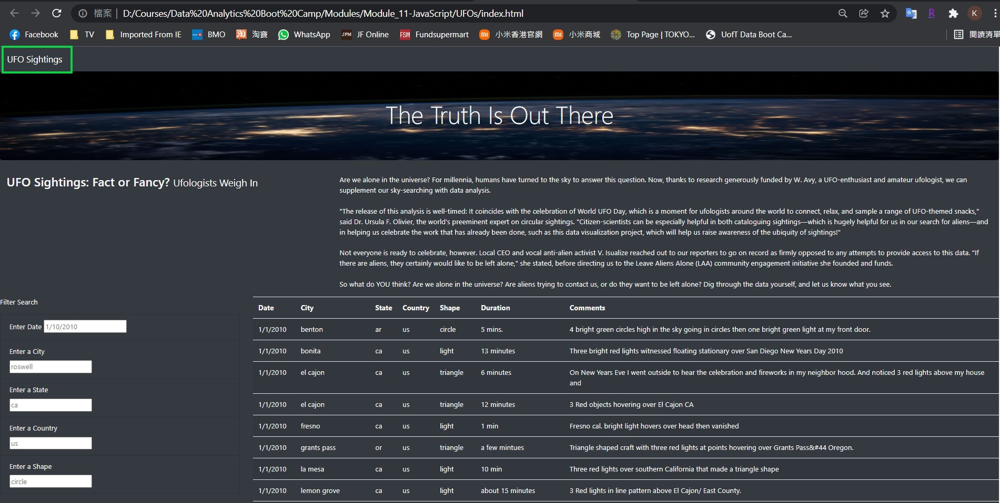
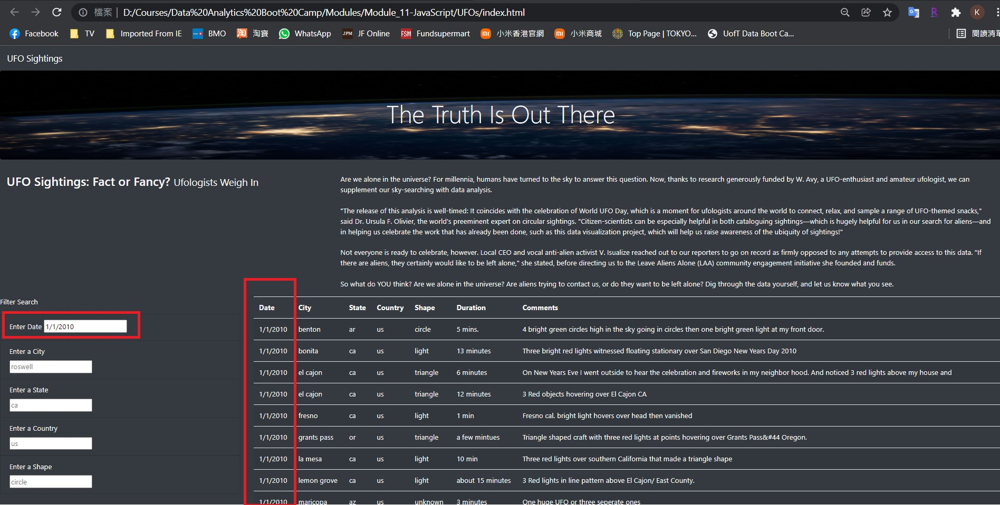
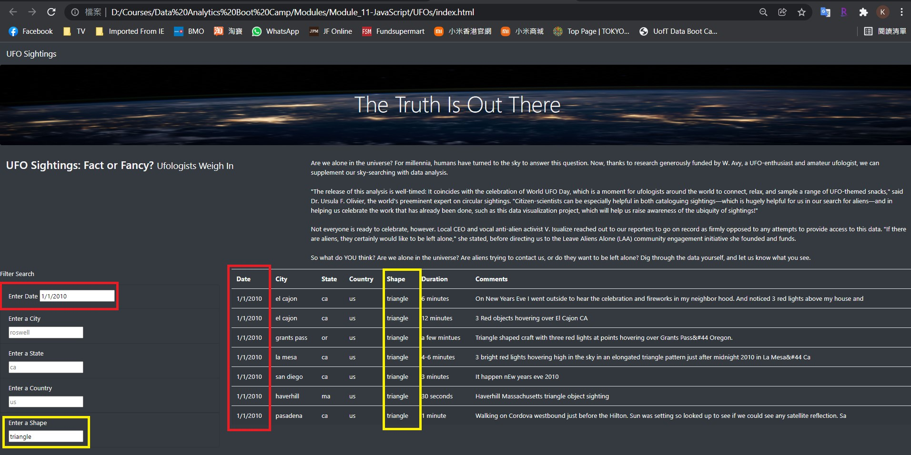

# UFOs

## Overview of Project:
In this module, we use JavaScript, HTML, and CSS to create a custom webpage with dynamic table that showcases different UFO sightings around the world.

Dana would like to provide a more in-depth analysis of UFO sightings by allowing users to filter for multiple criteria at the same time. In addition to the date, you’ll add table filters for the city, state, country, and shape.

## Results:
- How to use the search function for this webpage:
    1. Once you open the webpage, all the records are listed in the dynamic table by default.
    
    2. You may add filters for "date", "city", "state", "country", and "shape" in the corresponding filtering boxes from the left.
    3. For example, type in '1/1/2010' in the date field, and press [tab], the dynamic table will display records with date matched the input value.
    
    4. You may further narrow down the results by adding multiple criteria. For example, type in 'triangle' in the shape field, and press [tab], the table will show records that matched all the criteria.
    
    5. You can reset the search results by clicking the 'UFO Sightings' button in the top left hand corner.

## Summary:
- Although the webpage and dynamic table are working as intended, there is a main drawback of the design: the formatting of the input 'date' field is confusing.  Is it mm/dd/yyyy or dd/mm/yyyy?
- Recommendations for improvement:
    1. Replacing the text box with a calendar in the 'date' field.
    2. Setup a dropdown button for the 'Shape' field, and allow user to select the pre-defined shape from the list.
    3. Add a [Clear All] button to reset all values input in the filter search.

